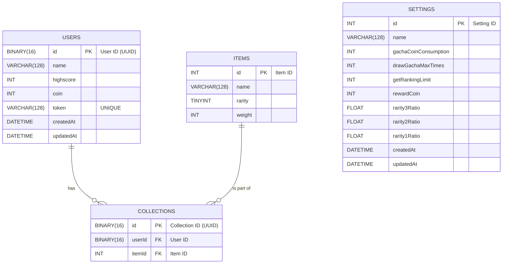

# Road to Cyberagent

42Tokyo「Road to」CyberAgentカリキュラムリポジトリ

[README.mdの原本](README_original.md)

## 実行方法

**MySQL, Redis, SwaggerUIサーバの起動**

```
make up
```

**MySQL, Redis, SwaggerUIサーバの停止**

```
make down
```

**APIの起動**

```
make
```

**Dockerボリュームの削除**

```
make rmvolumes
```

## ER図


